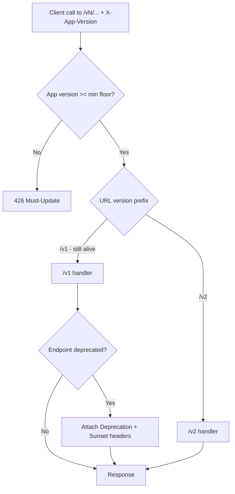
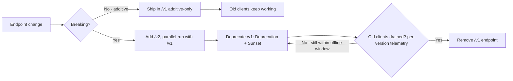

# Migration, Deploy & API-Lifecycle Runbook

> Part of the PreEmptly API final plan. See `00-README-index.md`. Cross-cutting ops — applies to **every schema-touching session** (01 baseline, 02 outbox/audit-adjacent, 03, 09 `saga_state`, 10 billing, generated-column promotion, new packs). Resolves **GAP-03** (DB migration) + **GAP-26** (API endpoint lifecycle) — the **same expand/contract discipline** applied to both the schema and the client-facing surface.
> **Deploy model confirmed 2026-07-19:** migrations run as a **dedicated Kubernetes Job (or explicit gated CI deploy step)** — single-run, before the new app version rolls out. DB is **Neon** (PITR available). Backups/PITR policy detail is tracked separately in **GAP-08**; this doc uses it as the recovery backstop.

## Migration execution model (Kubernetes / CI)

- **A migration is a gated Job, not part of app boot and not a per-pod initContainer.** `prisma migrate deploy` runs **once** as a K8s `Job` (or a manually-gated CI step) *before* the `Deployment` rolls out the new image. An initContainer would run per replica (N concurrent `migrate deploy` = lock contention / races) — forbidden.
- **Sequence per release:** gate → run migration Job → verify it succeeded → roll out the new app version → readiness probes (session 01/08) gate healthy pods → old pods drain.
- **Rolling updates mean old and new code run against the same schema at once.** Therefore **every migration must be backward-compatible with the currently-running version** — which is exactly what expand/contract guarantees.
- **The migration Job uses a role that can DDL**; the app's runtime role does not need DDL. (Distinct from the `service`/`BYPASSRLS` relay role — session 02.)

## Expand / contract (the core discipline — mandatory for anything with live data)

Never ship a breaking schema change in one migration. Split every non-additive change across **multiple releases**:

1. **Expand** — add the new column/table **nullable/with-default**, additive only. Old code ignores it; new code isn't live yet. Safe with old pods running.
2. **Backfill** — populate the new shape in batches (a Job), never a single locking `UPDATE`.
3. **Migrate reads/writes** — deploy app code that writes both and/or reads the new shape. Both old and new pods tolerate the schema.
4. **Contract** — in a **later** release, once no running version references the old shape, drop the old column/constraint.

**Worked examples:**
- *Add a `NOT NULL` column:* add nullable → backfill → set `NOT NULL` (or a `CHECK NOT VALID` then `VALIDATE`) in a later migration — never `ADD COLUMN ... NOT NULL` on a populated table in one shot.
- *Rename:* add new → dual-write → backfill → switch reads → drop old. Never `RENAME` in place while old code runs.
- *Promote a hot JSON field to a generated column (packs model):* add the generated column + GIN index `CONCURRENTLY` (expand) → point queries at it → (optionally) stop reading the JSON path. Zero-downtime by construction.

## Safe-migration rules

- **Additive-first, in order:** add columns/tables before any code depends on them; drop only after nothing does.
- **Indexes on live tables:** `CREATE INDEX CONCURRENTLY` (outside a transaction) to avoid write locks.
- **No table-rewrites in one migration** (avoid changing a column type in place on a big table; add-new + backfill instead).
- **Batch backfills** with limits/sleeps; never one unbounded `UPDATE`/`DELETE`.
- **RLS ships with the table (ties to session 02):** a new tenant-scoped/consumer-owned table's `ENABLE ROW LEVEL SECURITY` + policies go in the **same migration** that creates it — otherwise it's briefly unprotected. The 2nd-vertical acid test (06) should catch a table that lands without RLS.
- **One logical change per migration**, reviewed like code; migrations are immutable once merged (fix forward, never edit a shipped migration).

## Bad-migration recovery

Prisma `migrate deploy` is **forward-only** (no auto-down). Recovery order:
1. **Fix forward** — a new migration that corrects the mistake (the default; possible because expand/contract kept each step small and additive).
2. **Code rollback is always safe** — redeploy the previous image; because the schema is backward-compatible (expand/contract), the old version runs fine against the newer schema. **This is the normal rollback path — no DB restore.**
3. **PITR restore (last resort)** — only for genuine data corruption/loss: restore Neon to a point-in-time (GAP-08). Accept the data-loss window; announce; never routine.

## Rollout / rollback runbook (per release)

**Deploy:** gate release → run migration Job (`prisma migrate deploy`) → confirm success → `kubectl` rollout new image → readiness probes pass → old pods drain.
**Rollback:** `kubectl rollout undo` (or redeploy previous image) — **code-only, no DB restore**, valid because the migration was backward-compatible. If a *data* problem, escalate to PITR (last resort).
**Cutover (one-time, GAP-01):** pre-launch clean baseline; keep legacy hot for a short dual-run window; drop legacy tables in a dedicated migration after parity (see session 08).
**Broader runbook** (key rotation, incident response, Semaphore/Sentry alerts) lives in session 08 — this doc owns the DB-migration + deploy/rollback slice.

## Backups & Disaster Recovery (GAP-08)

- **Postgres = authoritative; Neon PITR.** Continuous backups → point-in-time restore. Set the **history-retention window** (target **30 days**; ≥7 minimum — plan-dependent, open sub-decision). Targets: **RPO ~minutes** (continuous), **RTO** = Neon branch/restore time (measure + document).
- **Redis (Upstash) = non-authoritative — not backed up.** Blast radius of Redis loss: mass **re-auth** (refresh tokens gone), cold rate-limit/OTP/idempotency fast-path — but **no data loss** (idempotency source-of-truth is the DB, GAP-02). Document the blast radius; don't back it up.
- **Restore drill on a cadence** (target quarterly): restore to a Neon branch, verify the app boots + key flows, time the RTO. (The go-live drill is a session-08 task.)
- **Backup encryption + erasure interaction (with GAP-06):** backups contain PII ciphertext. Crypto-shred erasure stays effective **only if the per-user key store is durable and NOT resurrected by a DB restore** — so keep keys in a **separate KMS** (never in the app DB), and make key deletion permanent. A Postgres PITR restore then **cannot un-erase** a user. Backups encrypted at rest.
- **Audit chain across restore:** the hash-chained `audit_log` is in Postgres → covered by PITR, but a **restore rewinds it** (later rows lost). Therefore a restore is itself an **audited event**, and the **chain is re-verified post-restore**. **Recommended:** periodically **anchor the chain head** (write the latest head hash to append-only / object-locked external storage) so a DB-level tamper-then-restore can't silently rewrite history. *(External anchor: recommended — confirm.)*
- **Runbook:** backup config, restore steps, and drill results live in the session-08 runbook alongside this section.

## API endpoint lifecycle & deprecation (GAP-26)

The **same expand/contract discipline as DB migrations, applied to the client-facing surface** — so stale/offline clients never hit an endpoint that changed under them. Core rule: **never break an endpoint in place.**

- **Additive-only within `/v1`** — add endpoints/optional fields; **never remove, rename, or change the semantics** of an existing `/v1` endpoint. Old clients keep working by construction (the API analog of "expand").
- **Breaking change → `/v2`, parallel-run** — stand up `/v2` alongside `/v1`; **never delete `/v1`** until telemetry shows old clients drained. An old build stays on the still-alive `/v1` and never sees the changed endpoint until *it* updates (the API analog of "contract").
- **Signal deprecation** — OpenAPI `deprecated: true` + **`Deprecation` / `Sunset`** response headers (RFC 8594) so tooling and clients see it coming.
- **Min-version gate = hard backstop (GAP-04)** — `X-App-Version` → **426 must-update** when a client is genuinely too old to function safely. Last resort, not the default; an optional startup capability/min-version response can *nudge* before calls.
- **Telemetry-gated removal** — instrument **per-endpoint × per-app-version** usage (PostHog/OTel); remove a deprecated endpoint or raise the min-version floor **only after drain**. Never remove blind.
- **Offline-window constraint (GAP-02) — the non-obvious one:** an offline device replays week-old requests, so the deprecation / parallel-run window must **exceed the max offline window** (a week+), and the replay path must target **stable** endpoints.
- **Contract tests (Pact, session 06)** — catch a breaking change in CI *before* release.
- **Rollback is code-only** (like DB): because the surface stayed additive/parallel, an old client keeps working against the newer server.

### Request-time version flow (how a call is gated + routed)

### Endpoint lifecycle (release-time expand/contract)

### Pack / extension versioning

Extensions (domain packs) version **independently** of the core, within a compatibility contract. Four distinct versions: **client app** (`X-App-Version`), **API URL** (`/v1`→`/v2`, shared/core-owned), **platform-contract** (the core spine packs build against), **pack release** (`DomainPack.version`, semver).

- **Core owns `/v1`→`/v2`** — a whole-platform URL bump is only for breaking changes to the **shared** surface (auth/assets/service-requests/tenancy). One vertical changing never forces a platform `/v2`.
- **Each pack versions its own sub-surface** `/v1/<key>/*` on its own timeline, following the same expand/contract + deprecation discipline above — LPG evolves without touching other verticals.
- **Packs declare a required core-contract version/range** (peer-dependency style). A breaking *core-contract* change bumps the platform-contract version; packs update against it **server-side** (recompile/register), **not** necessarily a client-facing `/v2`.
- **`DomainPack.version` surfaced in OpenAPI + telemetry** → the drain-tracking above becomes **per-pack × per-version**; retire a pack endpoint when *that pack's* clients drain, independent of core.
- Enables the Phase-2 **third-party/marketplace packs** vision (they must version independently).
- **Contract need (GAP-18):** the `DomainPack` contract keeps `version` (has it) **+ a core-contract-compatibility field**. Policy now; implementation ships with the extensions.

## Verification / acceptance (hooked into 06/08)

- A migration Job runs **once** per release (not per pod) and gates the rollout; a failed migration **blocks** the new version from going live.
- **Expand/contract proof:** a column add + backfill + later drop ships across ≥2 releases with old and new pods healthy throughout (no downtime, no errors from the old version).
- A new tenant-scoped table created by a migration **has RLS enabled in the same migration** (acid test 06).
- `CREATE INDEX CONCURRENTLY` used for indexes on non-empty tables (review gate).
- A code rollback (`rollout undo`) succeeds against the newer schema with no restore.
- PITR restore is exercised at least once in a drill (GAP-08).
- **API lifecycle (GAP-26):** a removed/renamed `/v1` endpoint **fails contract tests** (Pact, 06); a deprecated endpoint returns `Deprecation`/`Sunset`; per-version usage telemetry shows drain before removal; the parallel-run window exceeds the max offline window.

## Open sub-decisions

- K8s specifics: is the migration a `Job` in the release pipeline (Argo/Flux/Helm hook) vs an explicit gated CI step? (Both fit "single-run, gated, pre-rollout".)
- Migration DDL role vs app runtime role separation (least privilege).
- PITR retention window + restore-drill cadence (with GAP-08).
- Backfill Job framework (reuse BullMQ from session 03 vs a one-off script).
