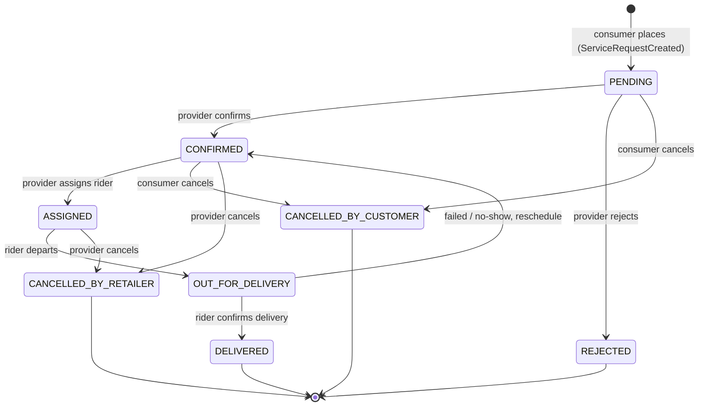

# Delivery Lifecycle — State Machine

> Part of the PreEmptly API final plan. See `00-README-index.md`. The explicit **states × transitions × guards × actors** for the LPG `delivery` lifecycle — the first instance of the `visit` archetype (RULE-PACK-06), built on the canonical statuses (RULE-ORDER-01). Realized by `orders`/`service-request` (session 05) + the saga (session 09).
> Statuses are stored on `service_request.status`; `lifecycleKey='delivery'`. Each transition emits the generic `ServiceRequestStatusChanged` event (GAP-15).

## States (canonical `service_request.status`, RULE-ORDER-01)

| Status | `visit` archetype | Terminal? |
|---|---|---|
| `PENDING` | requested | no |
| `CONFIRMED` | confirmed/scheduled | no |
| `ASSIGNED` | assigned (fulfiller) | no |
| `OUT_FOR_DELIVERY` | en-route / on-site | no |
| `DELIVERED` | complete | **yes** |
| `REJECTED` | — | **yes** |
| `CANCELLED_BY_CUSTOMER` | cancelled | **yes** |
| `CANCELLED_BY_RETAILER` | cancelled | **yes** |

> **`PENDING_SMS` is client-only** (offline queue, RULE-OFFLINE-01) — **never persisted**; on sync it becomes `PENDING` (server rejects the enum on write, GAP-02).
> **Role-specific labels** (RULE-ORDER-01): each role sees a different label for the same status — the label map is **client-side + localized** (never render the DB enum; ties to `error-taxonomy.md` "code not message" + `notifications-comms-spec.md` localization).

## Diagram

## Transitions (from → to · actor · guard · effect)

| From → To | Actor | Guard | Effect / event |
|---|---|---|---|
| _create_ → `PENDING` | consumer | valid + `assertLinked` to provider; **discount locked** (RULE-ORDER-02); Idempotency-Key | `ServiceRequestCreated` → notify provider |
| `PENDING` → `CONFIRMED` | provider | `assertProviderTenant` | notify consumer |
| `PENDING` → `REJECTED` | provider | tenant | **compensation:** unlock discount; notify consumer |
| `PENDING` → `CANCELLED_BY_CUSTOMER` | consumer | owner; not terminal | notify provider |
| `CONFIRMED` → `ASSIGNED` | provider | rider available | notify consumer + rider |
| `CONFIRMED` → `CANCELLED_BY_CUSTOMER` | consumer | owner; **pre-dispatch only** | notify provider |
| `CONFIRMED`/`ASSIGNED` → `CANCELLED_BY_RETAILER` | provider | tenant | **compensation:** release rider + unlock discount |
| `ASSIGNED` → `OUT_FOR_DELIVERY` | rider* | assigned to this request | notify consumer (ETA) |
| `OUT_FOR_DELIVERY` → `DELIVERED` | rider* | proof-of-service (photo/sig — visit archetype) | `ServiceRequestStatusChanged(delivered)` → `pack-lpg` writes `RefillLog`, emits `RefillLogged`, calls core `prediction.reset` (GAP-15); notify consumer |
| `OUT_FOR_DELIVERY` → `CONFIRMED` | rider*/provider | failed/no-show | reschedule; notify both |

\* `rider` role/client deferred (GAP-14/17); until then a provider acts these on the rider's behalf.

**Invalid transitions → `409 CONFLICT_STATE`** (error-taxonomy) — e.g. cancel after `DELIVERED`, or any edge not in the table (GAP-02).

## AuthZ per transition (actor summary)

- **Consumer:** create · cancel (pre-dispatch).
- **Provider:** confirm · reject · assign · cancel (any pre-`DELIVERED`) · (acts rider steps until GAP-14).
- **Rider\*:** out-for-delivery · delivered (proof) · mark failed.
- **System/saga:** timeouts + escalations only — **never mutates truth** (session 09).

## Timeouts / SLA (saga, session 09)

- `PENDING` not `CONFIRMED` within N min → escalate (provider nudge / ops alert).
- `CONFIRMED` not `OUT_FOR_DELIVERY` within N → escalate.
- `OUT_FOR_DELIVERY` not `DELIVERED` within N → escalate.
- Timeouts are **scheduled events** (BullMQ delayed job, single-runner GAP-05), not in-process timers.

## Compensations (saga)

- `REJECTED` / `CANCELLED_BY_RETAILER` → unlock discount, release rider.
- Cancel after assignment → release rider.
- `RefillLog` write fails after `prediction.reset` → `RefillReconciliationNeeded` (owning module handles; saga never writes another module's tables).

## Where it lands

- **Session 05** (`orders`/service-request): the transition endpoint `POST /v1/service-requests/:id/transition` (api-surface) enforces this table; emits via `withOutbox`; carries `serviceRequestId` correlation.
- **Session 09** (saga): the explicit process manager over these states + timeouts + compensations; generalized as the `visit` lifecycle template.

## Verification (hooked into 06)

- Happy path `PENDING→CONFIRMED→ASSIGNED→OUT_FOR_DELIVERY→DELIVERED` drives the saga to terminal; `DELIVERED` emits `RefillLogged` + resets prediction.
- Invalid transition (e.g. cancel a `DELIVERED`) → `409 CONFLICT_STATE`.
- Compensation fires on `REJECTED`/retailer-cancel (discount unlocked, rider released).
- Timeout at `PENDING` past SLA emits the escalation event **exactly once** (single-runner).
- `PENDING_SMS` never reaches the server.

## Open decisions

- **Failed-delivery / no-show** — reschedule to `CONFIRMED` (current) vs a dedicated `FAILED_DELIVERY` status (an enum addition → expand/contract, GAP-03/26).
- **Cancel windows** — exact point after which a consumer can no longer cancel (pre-dispatch vs pre-out-for-delivery).
- **Proof-of-service** requirement on `DELIVERED` (photo/signature/scan) — mandatory vs optional.
- **SLA values** (the N-minute thresholds) — per provider vs global.
